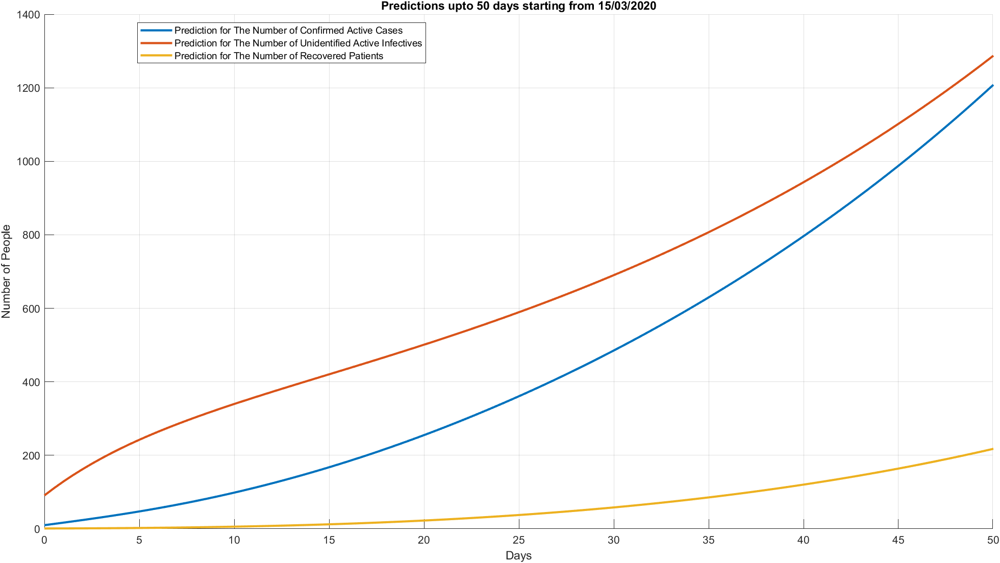
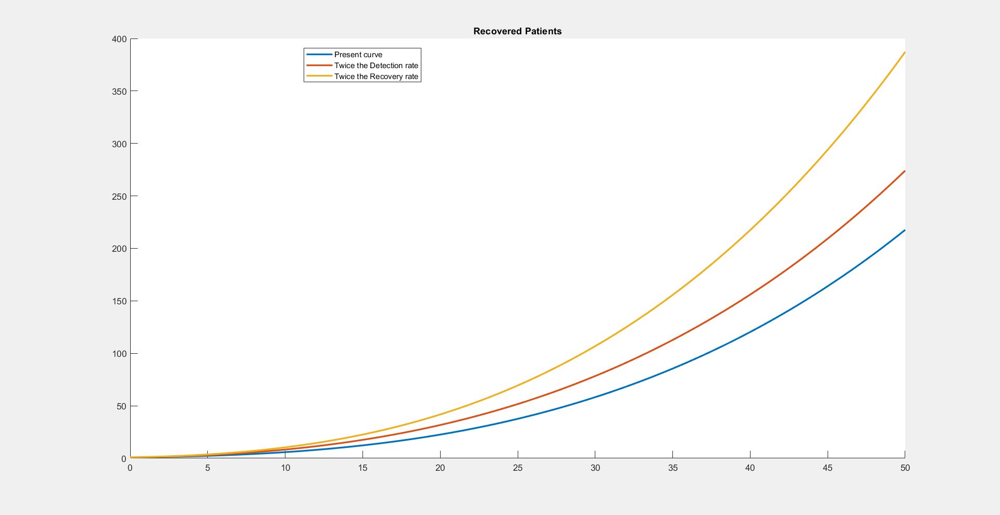

# Roles played by quarantining, social distancing and suspect testing in shaping the future of COVID-19 outbreak in Sri Lanka. 

[Matlab r2020]  
Published on: 28/03/2020

This repository is based on an extension of the model developed [here](https://github.com/ran1tha/corona).  

To get a basic idea of how epidemiological models are designed, I strongly suggest you refer to [my previous repository](github.com/ran1tha/corona). The model which is discussed there is designed with fewer parameters and states and hence less complicated. 

The content discussed here is at large dependent on the information found on [paper 1](https://www.ijidonline.com/article/S1201-9712(20)30137-5/fulltext) and [paper 2](https://www.researchgate.net/publication/338857202_Estimation_of_the_Transmission_Risk_of_the_2019-nCov_and_Its_Implication_for_Public_Health_Interventions).  

To skip all the technicalities and go directly to the predictions [click here!](#pred "Goto Predictions").

##

**DISCLAIMER**

* **Data considered here is recorded starting from 15th March 2020. [This is when WHO recognized Sri Lanka as a country that spreads COVID-19 via Local Transmission.](https://www.who.int/docs/default-source/coronaviruse/situation-reports/20200315-sitrep-55-covid-19.pdf?sfvrsn=33daa5cb_8)**  

* **Primary data source is [The Epidemiological Unit, Ministry of Health, Sri Lanka.](epid.gov.lk)** 

* **The number of Quarantined people discussed here are the ones housed at quarantine centres. Home-quarantined individuals are regarded as part of the wider (susceptible) community. The quarantined individuals are calculated based on the data found [here.](http://www.epid.gov.lk/web/images/pdf/Circulars/Corona_virus/covid-19%20exposure%20history.pdf) It is assumed that the exposed individuals are all taken into quarantine centres to be quarantined almost instantaneously.**

* **If someone can assist me in finding reliable data regarding the number of quarantined people please contact me at ranitha@ieee.org. A more reliable prediction can be made then.**

* **Initial guesses for all the parameters were made by averaging the parameters of China when the situation in China showed a similar behaviour like ours. Data taken from [paper 1.](https://www.ijidonline.com/article/S1201-9712(20)30137-5/fulltext)**

* **The content of this repository may only be used for educational purposes. The author (Ranitha Mataraarachchi) does not take any responsibility for circumstances caused by the misinterpretation of what is stated in this repository.**

## The Model

This model is a modified SIR epidemiological model. To understand how SIR models work [read this.](https://github.com/ran1tha/corona)  

Modifications are done to include quarantined individuals, suspected cases and unidentified infectives which basic SIR models fail to include.  

To understand better, here is the model we are going to consider.

 

The total population is grouped into 6 classes. 

* S - The susceptible population. This is the population which is vulnerable to the infection.

* E - The exposed population. People those who have been exposed to the infection by coming into contact with an infective person.

* I - The active unidentified infective population. People who are infected by the disease but have not yet been identified. This group of people are responsible for the spreading of the disease.

* R - Recovered people from the infection.

* Sq - Susceptible quarantined population. People who are quarantined in quarantine centres.

* B - The suspected class. People who have shown the symptoms of the disease and are suspected to have COVID-19.

* H - Active confirmed infectives. Infectives who are identified to be positive for COVID-19.

Here is how it works,  

Suppose the contact rate between individuals is ***c.*** Then the rate of contact between Susceptible population and Unidentified Infective population also becomes ***c.*** Now, by imposing contact tracing a proportion ***q*** of the contacted individuals move to the Suspected class(if effectively infected) or to the Susceptible Quarantined class (if not effectively infected). The probability that the disease is transmitted (probability of being effectively infected) given that a Susceptible person and Infective has come into contact is given by ***beta.*** The proportion of the population who has missed being quarantined, ***(1-q),*** move into the Exposed class on being effectively infected or remain in the Susceptible class if not.  

Now, the rate at which quarantined individuals move into the Susceptible Quarantined class is ***(1-beta) * c * q.***  
The rate at which quarantined individuals move into the Suspected class is ***beta * c * q.***  
The rate at which the people who are not quarantined move into the Exposed class is ***beta * c * (1-q).***  

Let constant ***m*** be the transition rate from Susceptible class to the Suspected class via general clinical examinations due to fever or illness-like symptoms. 

COVID-19 detection tests are performed on the Suspected class at a rate of ***b.*** The probability such a test yields a positive result is given by ***f.*** Therefore, the rate of people leaving the Suspected class on being subjected to a detection test is ***b.*** The rate at which people move into the Active confirmed infectives class is ***bf.*** And the rate at which people are released back into society on being tested negative is ***b(1-f).***

The transition rate of Exposed individuals into the Unidentified infectives class is ***sigma.*** And the rate at which Susceptible quarantined individuals are sent back into the wider community is ***lambda.***  

Unidentified active infectives are identified to be infectives at a rate of ***delta.*** Also, the rate of recovery is set to be ***gamma*** and the rate of mortality is ***alpha.***

Now the information above can be summarized into a set of simultaneous nonlinear ordinary differential equations as below,

  

The data available are,

* Daily confirmed infective population (H)

* Daily recovered population (R)

* Daily suspected population (B)

* Daily quarantined susceptible population (Sq)

The goal is to identify each parameter of these equations that best match the available data. Additionally, the initial Unidentified infectives and the initial Exposed population are also unknown.

## Markov Chain Monte Carlo (MCMC) method and Model fitting

To fit the data into the model and to get the values of unknown parameters Markov Chain Monte Carlo method was used.  

A Zero-Math Introduction to Markov Chain Monte Carlo Methods can be found [here.](https://towardsdatascience.com/a-zero-math-introduction-to-markov-chain-monte-carlo-methods-dcba889e0c50)

The git repo for MCMC Matlab toolbox can be accessed and freely downloaded from [here](https://github.com/mjlaine/mcmcstat) and it includes a variety of examples to be referred to.

***The Matlab code used by me is included in this repository.***

Following are the specifications for the Markov Chain Monte Carlo method used by me,

* An adaptive Metropolis-Hastings (M‐H) algorithm was adopted to carry out the MCMC procedure

* The algorithm is run for 600,000 iterations with a burn‐in of the first 100,000 iterations

* The Geweke convergence diagnostic method is employed to assess convergence of chains

### Parameter and Initial condition estimations by MCMC method

| Parameter /Initial Value | Definitions                                   | Estimation | Std        | Source                |
|--------------------------|-----------------------------------------------|------------|------------|-----------------------|
| ***c***                  | contact rate                                  | 2.9209     | 0.028852   | MCMC                  |
| ***beta***               | probability of transmission                   | 0.040584   | 0.00074229 | MCMC                  |
| ***q***                  | quarantined proportion                        | 0.7199     | 0.011218   | MCMC                  |
| ***m***                  | rate of transition from ***S*** to ***B***    | 9.7022e-08 | 6.0769e-10 | MCMC                  |
| ***b***                  | rate of detection                             | 0.027676   | 0.00187    | MCMC                  |
| ***f***                  | test positive probability                     | 0.39068    | 0.012253   | MCMC                  |
| ***delta***              | rate of transition from ***I*** to ***H***    | 0.043069   | 0.0011832  | MCMC                  |
| ***gamma***              | rate of recovery                              | 0.016662   | 0.00073477 | MCMC                  |
| ***alpha***              | mortiality rate                               | 0.010739   | 0.0001079  | MCMC                  |
| ***sigma***              | transition rate from ***E*** to ***I***       | 1/7        | -          | WHO                   |
| ***lambda***             | rate at which quarantined people are released | 1/14       | -          | Incubation Period     |
| ***H(0)***               | Initial confirmed active infectives           | 10         | -          | [source](epid.gov.lk) |
| ***B(0)***               | Initial suspected people                      | 133        | -          | [source](epid.gov.lk) |
| ***R(0)***               | Initial recovered people                      | 1          | -          | [source](epid.gov.lk) |
| ***Sq(0)***              | Initial susceptible quarantined people        | 122        | -          | [source](epid.gov.lk) |
| ***S(0)***               | Initial susceptibles (Population of SL)       | 21,413,249 |            | UN Data               |
| ***E(0)***               | Initial exposed people                        | 258.64     | 0.03895    | MCMC                  |
| ***I(0)***               | Initial unidentified active infectives        | 89.143     | 0.31578    | MCMC                  |

 

Here are the probability density functions of all the parameters / initial values derrived by MCMC 

 

##  Predictions

As of today (27th Marth 2020), there are,

* 99 confirmed active cases.

* 7 recovered patients

* 237 suspected cases

* 3549 people in quarantine centres

### By the model derived earlier, here are the predictions for the next 50 days.

  

### Forecast for the next 50 days with a 95% confidence interval. 

The black lines indicate the best fitting curve while the grey area indicates the 95% confidence interval based on the available data. Actual data is also plotted (circles) for comparison.

**Confirmed Active cases. *H(t)***
  

**Recovered cases cases. *R(t)***
  

**Unidentified Active cases. *H(t)***
  

**Suspected Cases. *B(t)***
  

**Quarantined people. *H(t)***
  

### How do the changes in parameters affect the forecast?

**Changing the contact rate**

The contact rate is the rate at which people comes into contact with each other.
At present, the estimated contact rate is 2.9209. Here are the forecasts for the next 50 days when the contact rate is doubled and halved.
  

It is visible that when the contact rate is cut half, both confirmed and unidentified infectives dramatically deplete. The opposite happens when the contact rate is doubled. Contact rate can be controlled by social distancing. It is worthwhile to notice that when the contact rate is reduced the recovered number of people slightly rose, which is unintuitive.

**Changing the quarantined proportion**

Quarantined proportion is the proportion of people quarantined given that they were exposed to an infected person.
At present, the estimated quarantined proportion is 0.7199. Here are the forecasts for the next 50 days when the quarantined proportion is doubled and halved.
  

When the quarantined rate is doubled, both confirmed and unidentified infectives dropped down. The rate of quarantining can be increased by strengthening contact tracing. However, it is also important to keep the quarantine rate below a threshold value because quarantined people may exceed the capacity quarantine centres can accommodate. 

**Changing the detection rate and recovery rate**

Detection rate is the rate at which suspected individuals are tested for COVID-19.
The recovery rate is the rate at which patients recover.
At present, the estimated detection rate is 0.027676 and the estimated recovery rate is 0.016662. Here are the forecasts for the next 50 days when the detection rate and the recovery rate are doubled. 
  

A considerable decrease in the identified cases was shown due to the recovery rate being high. Also, the rate of testing of the suspected cases increased the number of active cases. Since there are only a fewer number of confirmed cases in hospitals, it is better to increase the suspect testing rate and test as much as cases possible. If the suspect testing rate is increased in the future, the hospitals may run into the problem of not having enough capacity to accommodate new patients. Increasing these two parameters had no effect on the number of unidentified active cases. Hence the plots overlap with each other.

**Which parameter has the highest impact?**

Given here are the forecasts for the next 50 days where,

* Contact rate is halved

* Quarantined proportion is doubled

* Detection rate is doubled

* Recovery rate is doubled

  

By analysing the plots the best practice which can be taken to minimize this pandemic in Sri Lanka as of now is to increase the quarantine rate. More people quarantined can lead to a dramatic decrease in the confirmed/ unidentified infective population. Quarantine rate can be increased by effectively tracing the contacts of infected people. 

It is important not to underestimate the effect of social distancing. Social distancing reduces the contact rate which in turn leads to a lesser number of infectives. The general public can contribute to reducing the contact rate by staying indoors. Also, better hygienic practices can decrease the probability of transmission.

The rate at which suspected cases are tested for COVID-19 is also important to minimize the impact. Innovative steps can be taken by researchers to increase this detection rate. This can lead to a decrease in the identified active infectives. Also, by increasing the rate of recovery a higher number of people are discharged from the hospitals quickly and hence the hospital capacity to accommodate infective people is not exceeded. Again, researchers can work towards increasing the recovery rate. 

A concerned reader may investigate the provided information in determining which parameter(s) he or she can optimize in order to control and contain the COVID-19 outbreak in Sri Lanka.

## References

[1] : The effectiveness of quarantine and isolation determine the trend of the COVID-19 epidemics in the final phase of the current outbreak in China  
        https://www.ijidonline.com/article/S1201-9712(20)30137-5/fulltext
       
[2] : Estimation of the Transmission Risk of the 2019‐nCoV and Its Implication for Public Health Interventions   
        https://www.researchgate.net/publication/338857202_Estimation_of_the_Transmission_Risk_of_the_2019-nCov_and_Its_Implication_for_Public_Health_Interventions
        
[3] : MCMC toolbox for Matlab  
        https://mjlaine.github.io/mcmcstat/
        

 
 
 
 

Ranitha Mataraarachchi,  
Room No: 2234,  
Akbar-Nell Hall,  
Faculty of Engineering,  
University of Peradeniya,  
Peradeniya, Sri Lanka.

(+94)777722662  
ranitha@ieee.org  
[Facebook](https://www.facebook.com/1994ranitha) | [LinkedIn](https://www.linkedin.com/in/ranitha/)
